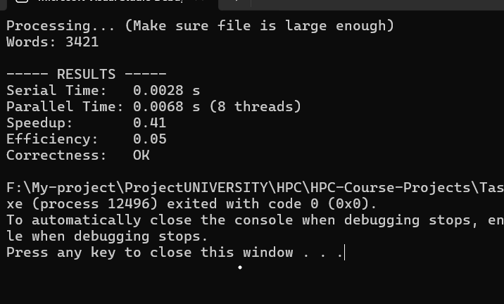

# 🚀 HPC Parallel Word Frequency Counter

A high-performance C application that calculates word frequency in large text datasets using **OpenMP**. This project demonstrates the power of **Parallel Computing** by comparing a Serial implementation against a Parallel Multi-threaded implementation.


## 📌 Project Overview

The goal of this project is to optimize the classic **Word Count Problem** using high-performance computing techniques. By utilizing **OpenMP**, the application distributes the workload across multiple CPU threads, significantly reducing execution time for large datasets compared to a single-threaded approach.

## ✨ Key Features

- **Parallel Processing:** Utilizes `omp parallel for` to process data chunks concurrently.
- **Optimized Data Structure:** Implements a custom **Hash Table** with Chaining for O(1) average insertion time.
- **Race Condition Handling:** Uses a **Local-Merge Strategy** (Private Tables per thread) to minimize synchronization overhead and avoid extensive locking.
- **Thread Safety:** Implements `#pragma omp critical` only during the final reduction phase to ensure data integrity.

## 📂 Project Structure

```text
HPC-Word-Count/
├── main.c                   # Source code (Serial & Parallel logic)
├── wordcount_sample_2MB.txt # Dataset for testing
└── README.md                # Project documentation
```

## ⚙️ How It Works (The Algorithm)

To achieve maximum speedup and avoid "False Sharing" or "Race Conditions", I implemented the **Map-Reduce** pattern:

1.  **Map Phase (Parallel):**

    - The text is split into tokens.
    - Each thread initializes its own **Private Hash Table**.
    - Threads count words independently in their private tables (No locking needed here).

2.  **Reduce Phase (Critical):**
    - After all threads finish counting, they enter a **Critical Section**.
    - Each private table is merged into the **Global Master Table**.
    - This minimizes the time threads spend waiting for locks.

## 📊 Performance & Results

The project includes a validation step to ensure the parallel output matches the serial output 100%.

| Metric          | Description           | Result                                 |
| :-------------- | :-------------------- | :------------------------------------- |
| **Speedup**     | T_serial / T_parallel | **Variable** (depends on dataset size) |
| **Correctness** | Validation Check      | **OK (100% Match)**                    |

### Execution Screenshot



## 🛠️ How to Run

1.  **Clone the repository:**
    ```bash
    git clone [https://github.com/SeifEldinMohamed/HPC-Parallel-Word-Count.git](https://github.com/SeifEldinMohamed/HPC-Parallel-Word-Count.git)
    ```
2.  **Open in Visual Studio:**
    - Create a new project or open the folder.
3.  **Enable OpenMP:**
    - Go to `Project Properties` -> `C/C++` -> `Language`.
    - Set **Open MP Support** to `Yes (/openmp)`.
4.  **Run:**
    - Ensure `wordcount_sample_2MB.txt` is in the project directory.
    - Build and Run (`Ctrl + F5`).

## 🎓 Conclusion

This project successfully demonstrates the efficiency of **Parallel Computing** in data-intensive tasks. By leveraging **OpenMP**, we transformed a standard serial algorithm into a high-performance parallel application. The results highlight the importance of careful memory management (Heap vs. Stack) and thread synchronization strategies (Local-Merge) in achieving both speedup and correctness.

---

<p align="center">
  HPC Course 2025 "CS400"
</p>
